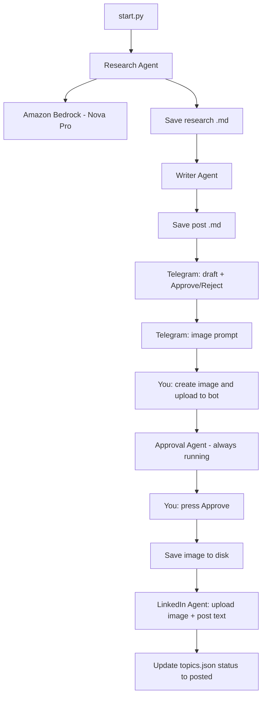

# LinkedIn Agent

Automated pipeline that researches a topic, writes a LinkedIn post in your series style, sends it to Telegram for approval, accepts your infographic image, and publishes **text + image** to LinkedIn.

Built for a **Generative AI learning series** (100+ topics) with one post at a time.

**Changelog:** see [CHANGELOG.md](CHANGELOG.md) — update it on every push.

---

## How it works



### Run the bot (one process)

```bash
python agents/approval/agent.py
```

Run **only one instance** per bot token.

| How to start a new draft | What happens |
|--------------------------|--------------|
| Send **`/next`** in Telegram | Research → write → draft + image prompt sent to you |
| Or `python start.py` | Same pipeline (optional, without Telegram commands) |

| After draft | Action |
|-------------|--------|
| Upload image | Send photo to the bot |
| Publish | Press **Approve** on the draft message |

---

## Project structure

```
LinkedIn-agent/
├── start.py                 # Entry: run research pipeline
├── config.py                # Loads .env and paths
├── topics.json              # All topics + status (active / posted / rejected)
├── topics_store.py          # Read/update topics.json
├── _drafts.json             # Pending drafts (created at runtime)
├── README.md                # Setup and usage (this file)
├── CHANGELOG.md             # Update on every git push
├── agents/
│   ├── researcher/          # Bedrock research from topics.json
│   ├── writer/              # Bedrock LinkedIn post (few-shot style)
│   ├── telegram/            # Send draft + image prompt to Telegram
│   ├── approval/            # Poll Telegram; image upload + approve flow
│   ├── linkedin/            # Image upload + post to LinkedIn API
│   │   └── text_format.py   # Escape LinkedIn "little text" reserved chars
│   └── image/
│       ├── prompt.py        # Infographic prompt (black background)
│       └── images/          # Saved PNG/JPG from Telegram
├── test_gemini_image.py     # Optional: test Gemini image API (standalone)
└── .env.example
```

---

## Setup

### 1. Python dependencies

```bash
pip install boto3 requests
# Optional (only for test_gemini_image.py):
pip install google-genai
```

### 2. Environment variables

Copy `.env.example` to `.env` and fill in:

| Variable | Purpose |
|----------|---------|
| `TELEGRAM_BOT_TOKEN` | Telegram bot token |
| `TELEGRAM_CHAT_ID` | Your chat ID (only this chat can approve/upload) |
| `LINKEDIN_ACCESS_TOKEN` | LinkedIn API bearer token |
| `LINKEDIN_PERSON_ID` | Numeric person ID for `urn:li:person:{id}` |
| `AWS_REGION` | Bedrock region (e.g. `us-east-1`) |
| `BEDROCK_TEXT_MODEL_ID` | e.g. `amazon.nova-pro-v1:0` |
| `TOPICS_FILE` | Default `topics.json` |

AWS credentials must be configured for Bedrock (`aws configure` or env vars).

### 3. Topics file

`topics.json` is a list of topics:

```json
[
  {
    "topicId": "17",
    "topicName": "TF-IDF",
    "status": "active"
  }
]
```

**Status values:** `active` | `posted` | `rejected`

The pipeline picks the **first `active` row top-to-bottom** (line by line). After a successful LinkedIn post, status becomes `posted`.

---

## Usage

### Telegram commands (from your chat only)

| Command | Action |
|---------|--------|
| `/next` or `/generate` | Run pipeline for **first active** topic in `topics.json` |
| `/next 17` | Run pipeline for topic id **17** (must be `active`) |
| `/status` | Show which topic is next |
| `/help` | List commands |

### Typical workflow

1. Send **`/next`** to the bot.  
2. You receive: post draft (Approve/Reject) + image prompt.  
3. Create infographic, **upload photo** to the bot.  
4. Press **Approve** → post + image go to LinkedIn; topic marked `posted`.

### Optional: generate without Telegram command

```bash
python start.py
```

Same as `/next`, but run from the terminal instead of Telegram.

---

## Post style (Writer agent)

Posts follow your **Generative AI learning series** format:

- Hook line  
- `🚀 Post {N} of my Generative AI learning series`  
- Short explanation + simple example + real-world analogy  
- Key takeaway  
- `Next I'll explain:` → 👉 next topic from `topics.json`  
- `Follow the series if you're learning Generative AI.`  
- Hashtags (e.g. `#GenerativeAI #NLP #MachineLearning #AI`)

**Few-shot examples** in `agents/writer/prompt.py` teach Bedrock the style. Few-shot is **not** sent to LinkedIn—only the final generated text is.

---

## LinkedIn image posting

On approve, the LinkedIn agent:

1. `POST /rest/images?action=initializeUpload`  
2. `PUT` image bytes to upload URL  
3. `POST /rest/posts` with `commentary` + `content.media`

### Little-text escaping (important)

LinkedIn silently truncates commentary if special characters are not escaped (`(`, `)`, `#`, `*`, etc.).  
`agents/linkedin/text_format.py` escapes these before publish so the **full post** appears.

---

## Image workflow

- **Image prompt** is built in `agents/image/prompt.py` (black background, 16:9, minimal text).  
- **No auto image generation** in the main pipeline. Optional: `test_gemini_image.py` for Gemini experiments.  
- You create the image manually and upload via Telegram.

---

## Troubleshooting

| Issue | Fix |
|-------|-----|
| Telegram `409 Conflict` | Stop duplicate `approval/agent.py` processes; run only one. |
| LinkedIn post cut off mid-text | Ensure `text_format.py` is used; avoid unescaped `( )` in drafts. |
| `No active topics` | Set a topic to `"status": "active"` in `topics.json`. |
| Approve without image | Upload photo to bot first (caption = topic id). |
| Bedrock errors | Check model access and AWS credentials in your region. |

---

## Security

### Telegram bot access

The approval agent only acts on updates from **`TELEGRAM_CHAT_ID`** in `.env`:

| Action | Strangers (other chats) |
|--------|-------------------------|
| `/next`, `/status`, etc. | Blocked — “Unauthorized chat.” |
| Photo uploads | Ignored |
| Approve / Reject buttons | Blocked — alert “Unauthorized.” |

Drafts are **sent only** to `TELEGRAM_CHAT_ID`, so random users never see your post text or Approve buttons unless you add the bot to a **group** or forward messages.

**Recommendations**

- Use a **private chat** with the bot (your user id = chat id). Do not add the bot to public groups.
- Do not share the bot username publicly; anyone can still `/start` the bot, but they cannot trigger your pipeline or publish to LinkedIn.
- In [@BotFather](https://t.me/BotFather), you can disable group adds if you want (`/setjoingroups` → Disable).
- Never commit `.env` or `TELEGRAM_BOT_TOKEN`. Rotate the token in BotFather if it leaks.

---

## License

Private / personal project. Adjust as needed for your use.
